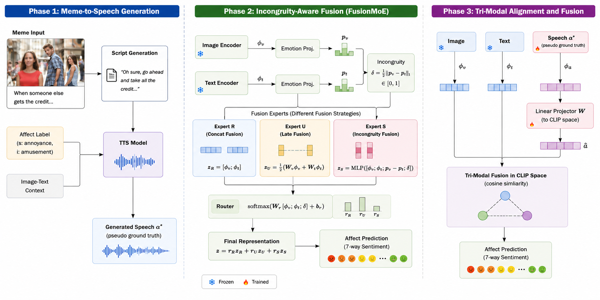

# MemeSonic

Memes are multimodal — but their meaning doesn't come from image and text *agreeing*. It comes from them *fighting*. A cheerful dog sitting in a burning room saying "this is fine" is funny *because* the image and text contradict each other.

MemeSonic is built around that insight: **incongruity is the signal, not noise.**

[Demo 1](https://tinyurl.com/4schzjb5) · [Demo 2](https://gemini.google.com/share/44df652817ed)

---

## Phase 1 — Give memes a voice

We train a prosody adapter to read the emotional subtext of a meme (not just its surface text) and generate expressive speech that matches the tone — sarcastic, triumphant, deadpan. The resulting audio externalizes affect that normally only lives in the reader's head.

**Notebooks:**
- [audio/Audio_Gen_Trimodal_Align.ipynb](audio/Audio_Gen_Trimodal_Align.ipynb) — prosody adapter, TTS generation, MOS eval
- [audio/adapter1_memotion_colab.ipynb](audio/adapter1_memotion_colab.ipynb) — adapter training on Memotion

---

## Phase 2 — Model the conflict

Standard multimodal fusion assumes image and text are aligned. For memes, that assumption breaks. We explicitly compute an *incongruity score* $\delta$ between image and text emotion distributions, then route each meme through the fusion strategy it actually needs: pooling for literal memes, conflict modeling for ironic ones. This is FusionMoE.

**Notebooks:**
<!-- - [image-text-fusion/incongruity_aware_fusion.ipynb](image-text-fusion/incongruity_aware_fusion.ipynb) — incongruity score $\delta$, Incongruity Fusion, all trained baselines -->
- [image-text-fusion/fusion_moe.ipynb](image-text-fusion/fusion_moe.ipynb) — FusionMoE 3-expert router, training across all 10 tasks
- [image-text-fusion/llm_baseline_eval.ipynb](image-text-fusion/llm_baseline_eval.ipynb) — LLM zero-shot baselines (GPT-4o, Gemini, o4-mini, Qwen3)
<!-- - [image-text-fusion/llava_probing.ipynb](image-text-fusion/llava_probing.ipynb) — LLaVA probing for affective representation -->
- [image-text-fusion/eda/meme_dataset.ipynb](image-text-fusion/eda/meme_dataset.ipynb) — dataset EDA, label distributions, incongruity statistics

---

## Phase 3 — Does audio help understanding?

We loop the generated speech back in as a third modality. Naively fusing it does nothing — the embedding spaces are incompatible. A single learned projector fixes that, lifting sentiment accuracy from 27% to 82%. The audio was carrying signal the whole time; the barrier was representation mismatch.

**Notebooks:**
- [audio/Audio_Modal_Contribution.ipynb](audio/Audio_Modal_Contribution.ipynb) — Emotion2Vec projector, tri-modal alignment study
<!-- - [image-text-fusion/colearning_audio.ipynb](image-text-fusion/colearning_audio.ipynb) — audio–vision co-learning experiments -->

---

## Homeworks

- HW1: [Music & Motion Data Preparation](homework/homework1/README.md)
- HW2: [Multimodal Fusion and Alignment — MET Meme](homework/homework2/README.md)
- HW3: [Fine-Tuning VLMs for Meme Classification](homework/homework3/README.md)
- HW4: [GRPO Fine-tuning for Meme Intention](homework/homework4/README.md)
- HW5: [AI Agents — Meme-to-Audio Agent](homework/homework5/README.md)
